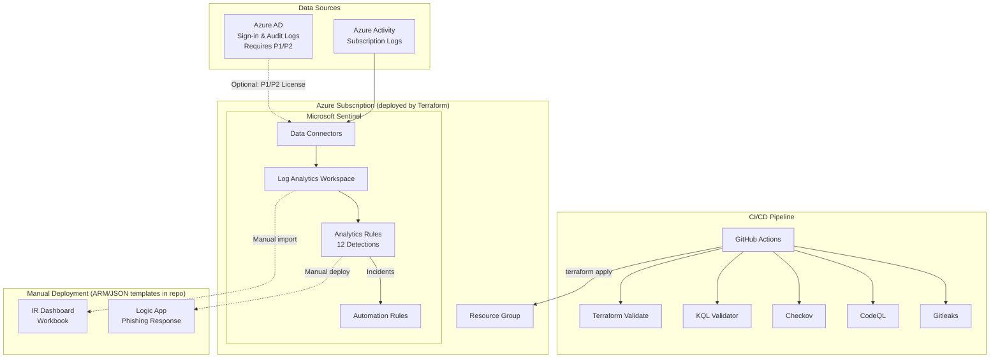

# Sentinel Detection Lab

Detection-as-code framework for Microsoft Sentinel. Terraform deploys the Sentinel workspace, 12 analytics rules, and 3 automation rules. The repo also includes an IR playbook (ARM template) and dashboard (Workbook JSON) that require separate manual deployment steps documented below.

## Architecture



## Deployment Results

This project was deployed and validated against a live Azure subscription. `terraform apply` provisions 19 resources automatically. The playbook and workbook are **not** deployed by Terraform — they are ARM/JSON templates that require separate manual steps.

| Resource | Count | Deployed by | Status |
|----------|-------|-------------|--------|
| Resource Group (`rg-sentinel-lab`) | 1 | `terraform apply` | Deployed |
| Log Analytics Workspace (PerGB2018, 31-day retention) | 1 | `terraform apply` | Deployed |
| Sentinel Onboarding | 1 | `terraform apply` | Deployed |
| Azure Activity Log Connector | 1 | `terraform apply` | Deployed |
| Scheduled Analytics Rules | 12 | `terraform apply` | Deployed |
| Automation Rules | 3 | `terraform apply` | Deployed |
| Azure AD Connector | 1 | `terraform apply` | Requires P1/P2 license |
| IR Playbook (Logic App) | 1 | Manual ARM deployment | Not deployed |
| IR Dashboard (Workbook) | 1 | Manual Sentinel import | Not deployed |

### Azure AD Connector (Not Deployed)

The Azure AD sign-in and audit log connector (`azurerm_sentinel_data_connector_azure_active_directory`) requires an **Azure AD P1 or P2 license** and returns `InvalidLicense` (HTTP 401) without one. This connector is commented out in `terraform/data-connectors.tf` and can be enabled by uncommenting the resource block once the appropriate licensing is in place.

The Azure Activity Log connector works without any additional licensing and is deployed by default, providing Administrative, Security, Alert, and Policy log categories.

### Deployment Notes

During deployment, several Sentinel API constraints were discovered and addressed:

- **MITRE technique format**: The Sentinel API only accepts parent technique IDs in `T####` format (e.g., `T1110`), not sub-techniques like `T1110.003`. Sub-technique detail is preserved in the KQL file metadata headers for documentation purposes.
- **Tactic/technique alignment**: Each technique must be paired with a tactic that MITRE maps it to. For example, `T1078` (Valid Accounts) maps to `InitialAccess`/`Persistence`/`PrivilegeEscalation`/`DefenseEvasion` but not `CredentialAccess` or `LateralMovement`.
- **Entity mapping columns**: Entity mappings must reference columns that exist in the KQL query output. Each detection exports standardized `Entity_Account`, `Entity_IP`, and/or `Entity_Host` columns for this purpose.
- **Automation rule names**: Must be valid UUIDs, not human-readable strings.
- **Automation rule conditions**: The `condition_json` field expects a JSON array (`[{...}]`), not an object with a `clauses` key.
- **Incident classification**: Must use full enum values like `BenignPositive_SuspiciousButExpected`, not shortened forms.
- **Resource provider registration**: On fresh subscriptions with `azurerm` ~>4.0, auto-registration can hit 409 conflicts. Setting `resource_provider_registrations = "none"` in the provider block and manually registering only the needed providers (`Microsoft.OperationalInsights`, `Microsoft.SecurityInsights`, `Microsoft.OperationsManagement`, `Microsoft.Insights`) resolves this.

## MITRE ATT&CK Coverage

| Tactic | Technique | Detection | Severity |
|--------|-----------|-----------|----------|
| Credential Access | T1110 - Brute Force | Brute Force Sign-in Attempts | Medium |
| Credential Access | T1110 - Password Spraying | Password Spray Attack | High |
| Initial Access | T1078 - Valid Accounts | Impossible Travel Sign-in | High |
| Initial Access | T1566 - Phishing | Suspicious Inbox Rule Created | High |
| Initial Access | T1566 - Spearphishing Link | Suspicious OAuth Application Consent | Medium |
| Persistence | T1137 - Office Application Startup | New Inbox Forwarding Rule | Medium |
| Persistence | T1136 - Create Cloud Account | Suspicious Service Principal Creation | Medium |
| Lateral Movement | T1021 - Remote Desktop Protocol | Anomalous RDP Sign-in | Medium |
| Lateral Movement | T1078 - Valid Accounts | Multi-Host Admin Logon | High |
| Exfiltration | T1567 - Exfiltration Over Web Service | Bulk File Download | Medium |
| Collection / Exfiltration | T1114 - Email Forwarding Rule | Mail Forwarding to External Domain | High |
| Defense Evasion | T1027 - Obfuscated Files | Encoded PowerShell Execution | High |

## Prerequisites

- Azure subscription (free trial works)
- [Terraform](https://www.terraform.io/downloads) >= 1.5.0
- [Azure CLI](https://docs.microsoft.com/en-us/cli/azure/install-azure-cli) (`az login` authenticated)
- Python 3.11+ (for KQL validation)
- **Owner** or **Contributor** role on the Azure subscription
- Azure AD P1/P2 license (optional, for Azure AD sign-in/audit log connector)

## Quick Start

```bash
# Clone
git clone https://github.com/n1ops/sentinel-detection-lab.git
cd sentinel-detection-lab

# Authenticate to Azure
az login --tenant <your-tenant>.onmicrosoft.com

# Register required resource providers (first-time only)
az provider register --namespace Microsoft.OperationalInsights --wait
az provider register --namespace Microsoft.SecurityInsights --wait
az provider register --namespace Microsoft.OperationsManagement --wait
az provider register --namespace Microsoft.Insights --wait

# Deploy infrastructure
cd terraform
terraform init
terraform plan -out=tfplan
terraform apply tfplan

# Validate detections locally
cd ..
python scripts/validate_kql.py
```

### Enabling the Azure AD Connector

If you have Azure AD P1/P2 licensing, uncomment the Azure AD connector in `terraform/data-connectors.tf`:

```hcl
resource "azurerm_sentinel_data_connector_azure_active_directory" "aad" {
  name                       = "aad-connector"
  log_analytics_workspace_id = azurerm_sentinel_log_analytics_workspace_onboarding.sentinel.workspace_id
  tenant_id                  = data.azurerm_subscription.current.tenant_id
}
```

Then run `terraform apply` to deploy the connector. This enables ingestion of Azure AD sign-in logs and audit logs into the Sentinel workspace.

### Teardown

```bash
cd terraform
terraform destroy
```

## Project Structure

```
sentinel-detection-lab/
├── terraform/                    # Infrastructure as Code
│   ├── main.tf                   # Provider, backend, resource group
│   ├── variables.tf              # Input variables
│   ├── outputs.tf                # Workspace IDs, Sentinel URL
│   ├── sentinel.tf               # Log Analytics + Sentinel onboarding
│   ├── data-connectors.tf        # Azure Activity connector (AAD optional)
│   ├── analytics-rules.tf        # 12 KQL detection rules as code
│   └── automation-rules.tf       # Auto-severity, auto-triage rules
├── detections/                   # KQL detection library
│   ├── credential-access/        # Brute force, password spray, impossible travel
│   ├── initial-access/           # Phishing inbox rules, OAuth consent
│   ├── persistence/              # Forwarding rules, service principals
│   ├── lateral-movement/         # Anomalous RDP, multi-host admin
│   ├── exfiltration/             # Bulk downloads, mail forwarding
│   └── defense-evasion/          # Encoded PowerShell
├── playbooks/                    # Incident response automation (manual deploy)
│   └── phishing-response/        # Logic App ARM template (not deployed by TF)
├── workbooks/                    # Sentinel dashboards (manual import)
│   └── ir-dashboard.json         # 6-tile IR dashboard (not deployed by TF)
├── scripts/
│   └── validate_kql.py           # KQL metadata validator
└── .github/workflows/
    ├── security.yml              # Reusable DevSecOps pipeline
    └── sentinel-validate.yml     # PR validation for KQL + Terraform
```

## Detection Library

Each detection is a standalone `.kql` file with a standardized metadata header:

```
// Name: Detection Name
// MITRE: T1110.001 - Credential Access / Brute Force
// Severity: Medium
// Description: What this detection finds
// Query Frequency: 1h
// Query Period: 1h
// Trigger: gt 0
```

Detections query standard Sentinel tables: `SigninLogs`, `AuditLogs`, `OfficeActivity`, and `SecurityEvent`. Each query exports standardized entity columns (`Entity_Account`, `Entity_IP`, `Entity_Host`) for Sentinel entity mapping.

## CI/CD Pipeline

### Security Pipeline (`security.yml`)

Calls the [n1ops/devsecops-pipeline-reference](https://github.com/n1ops/devsecops-pipeline-reference) reusable workflow:

- **Gitleaks** — Secret detection across all commits
- **CodeQL** — Static analysis of Python validation scripts
- **Checkov** — IaC security scanning of Terraform configs
- **KQL Validator** — Metadata and format validation of all detections

### PR Validation (`sentinel-validate.yml`)

Runs on pull requests touching detections, playbooks, or Terraform:

- Validates KQL metadata headers (Name, MITRE, Severity, Description)
- Validates ARM template JSON structure
- Runs `terraform validate` and `terraform fmt -check`

## IR Playbook (Manual Deployment Required)

> **Not deployed by `terraform apply`.** This is an ARM template that must be deployed separately.

The file `playbooks/phishing-response/azuredeploy.json` is an ARM template that defines a Logic App. When deployed and fully configured, it:

1. Triggers on Sentinel incident creation
2. Extracts entities (IP, Account, URL) via the Sentinel API connector
3. Posts enrichment details to a Microsoft Teams channel
4. Adds a comment to the Sentinel incident
5. Tags the incident with MITRE technique identifiers (T1566-Phishing)

### How to deploy the playbook

```bash
# Deploy the ARM template into the same resource group
az deployment group create \
  --resource-group rg-sentinel-lab \
  --template-file playbooks/phishing-response/azuredeploy.json \
  --parameters \
    SentinelWorkspaceId="<your-workspace-resource-id>" \
    TeamsChannelId="<your-teams-channel-id>" \
    TeamsGroupId="<your-teams-group-id>"
```

### Post-deployment manual steps

1. **Authorize the Teams API connection**: In the Azure Portal, go to the Logic App > API Connections > `teams` connection > Edit API connection > Authorize. This requires a user with access to the target Teams channel to sign in and grant consent.
2. **Authorize the Sentinel API connection**: Same process for the `azuresentinel` connection, or it will use the Logic App's managed identity if the role is assigned.
3. **Assign RBAC role**: The Logic App uses a SystemAssigned managed identity. Grant it the **Microsoft Sentinel Responder** role on the Sentinel workspace so it can read incidents, add comments, and update tags:
   ```bash
   az role assignment create \
     --assignee "<logic-app-managed-identity-principal-id>" \
     --role "Microsoft Sentinel Responder" \
     --scope "<sentinel-workspace-resource-id>"
   ```
4. **Test the playbook**: Create a test incident in Sentinel and verify the Logic App triggers, posts to Teams, and adds a comment.

Without these manual steps, the Logic App will deploy but will **not** be able to connect to Teams or interact with Sentinel incidents.

## IR Dashboard (Manual Import Required)

> **Not deployed by `terraform apply`.** This is a Workbook JSON template that must be imported manually into Sentinel.

The file `workbooks/ir-dashboard.json` is a Sentinel Workbook template with 6 visualization tiles:

1. **Incidents over time** — Bar chart by severity
2. **Top targeted accounts** — Table of most-attacked users
3. **MITRE ATT&CK coverage** — Grid of active detections by tactic
4. **Open incidents by age** — Heatmap showing incident aging
5. **Alert source distribution** — Pie chart by product
6. **MTTR trend** — Mean time to resolve over time

### How to import the workbook

1. Open the Azure Portal and navigate to **Microsoft Sentinel** > your workspace > **Workbooks**
2. Click **Add workbook** > **Advanced Editor** (the `</>` icon)
3. Replace the contents with the JSON from `workbooks/ir-dashboard.json`
4. Update the `fallbackResourceIds` array at the bottom of the JSON to reference your actual workspace resource ID
5. Click **Apply** then **Save**

The workbook queries `SecurityIncident` and `SecurityAlert` tables, so it will only show data once incidents start being generated by the analytics rules.

## What `terraform apply` Deploys

| Resource | Type | Status |
|----------|------|--------|
| Resource Group | `azurerm_resource_group` | Deployed |
| Log Analytics Workspace | `azurerm_log_analytics_workspace` | Deployed |
| Sentinel Onboarding | `azurerm_sentinel_log_analytics_workspace_onboarding` | Deployed |
| Azure AD Connector | `azurerm_sentinel_data_connector_azure_active_directory` | Commented out (requires P1/P2) |
| Activity Log Connector | `azurerm_monitor_diagnostic_setting` | Deployed |
| Analytics Rules (x12) | `azurerm_sentinel_alert_rule_scheduled` | Deployed |
| Automation Rules (x3) | `azurerm_sentinel_automation_rule` | Deployed |

## What Requires Manual Deployment

| Resource | Template File | Deploy Method |
|----------|--------------|---------------|
| IR Playbook (Logic App) | `playbooks/phishing-response/azuredeploy.json` | `az deployment group create` + manual API connection auth |
| IR Dashboard (Workbook) | `workbooks/ir-dashboard.json` | Manual import via Sentinel Portal > Workbooks > Advanced Editor |

## License

MIT
