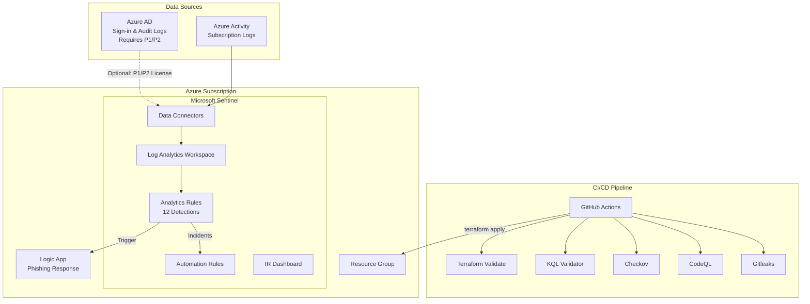

# Sentinel Detection Lab

Detection-as-code framework for Microsoft Sentinel, deploying analytics rules, incident response playbooks, and dashboards via Terraform with full CI/CD integration.

## Architecture



## Deployment Results

This project was deployed and validated against a live Azure subscription. All 19 resources were successfully provisioned:

| Resource | Count | Status |
|----------|-------|--------|
| Resource Group (`rg-sentinel-lab`) | 1 | Deployed |
| Log Analytics Workspace (PerGB2018, 31-day retention) | 1 | Deployed |
| Sentinel Onboarding | 1 | Deployed |
| Azure Activity Log Connector | 1 | Deployed |
| Scheduled Analytics Rules | 12 | Deployed |
| Automation Rules | 3 | Deployed |
| **Total** | **19** | **All succeeded** |

### Azure AD Connector (Not Deployed)

The Azure AD sign-in and audit log connector (`azurerm_sentinel_data_connector_azure_active_directory`) requires an **Azure AD P1 or P2 license** and returns `InvalidLicense` (HTTP 401) without one. This connector is commented out in `terraform/data-connectors.tf` and can be enabled by uncommenting the resource block once the appropriate licensing is in place.

The Azure Activity Log connector works without any additional licensing and is deployed by default, providing Administrative, Security, Alert, and Policy log categories.

### Deployment Notes

During deployment, several Sentinel API constraints were discovered and addressed:

- **MITRE technique format**: The Sentinel API only accepts parent technique IDs in `T####` format (e.g., `T1110`), not sub-techniques like `T1110.003`. Sub-technique detail is preserved in the KQL file metadata headers for documentation purposes.
- **Tactic/technique alignment**: Each technique must be paired with a tactic that MITRE maps it to. For example, `T1078` (Valid Accounts) maps to `InitialAccess`/`Persistence`/`PrivilegeEscalation`/`DefenseEvasion` but not `CredentialAccess` or `LateralMovement`.
- **Entity mapping columns**: Entity mappings must reference columns that exist in the KQL query output. Each detection exports standardized `Entity_Account`, `Entity_IP`, and/or `Entity_Host` columns for this purpose.
- **Automation rule names**: Must be valid UUIDs, not human-readable strings.
- **Automation rule conditions**: The `condition_json` field expects a JSON array (`[{...}]`), not an object with a `clauses` key.
- **Incident classification**: Must use full enum values like `BenignPositive_SuspiciousButExpected`, not shortened forms.
- **Resource provider registration**: On fresh subscriptions with `azurerm` ~>4.0, auto-registration can hit 409 conflicts. Setting `resource_provider_registrations = "none"` in the provider block and manually registering only the needed providers (`Microsoft.OperationalInsights`, `Microsoft.SecurityInsights`, `Microsoft.OperationsManagement`, `Microsoft.Insights`) resolves this.

## MITRE ATT&CK Coverage

| Tactic | Technique | Detection | Severity |
|--------|-----------|-----------|----------|
| Credential Access | T1110 - Brute Force | Brute Force Sign-in Attempts | Medium |
| Credential Access | T1110 - Password Spraying | Password Spray Attack | High |
| Initial Access | T1078 - Valid Accounts | Impossible Travel Sign-in | High |
| Initial Access | T1566 - Phishing | Suspicious Inbox Rule Created | High |
| Initial Access | T1566 - Spearphishing Link | Suspicious OAuth Application Consent | Medium |
| Persistence | T1137 - Office Application Startup | New Inbox Forwarding Rule | Medium |
| Persistence | T1136 - Create Cloud Account | Suspicious Service Principal Creation | Medium |
| Lateral Movement | T1021 - Remote Desktop Protocol | Anomalous RDP Sign-in | Medium |
| Lateral Movement | T1078 - Valid Accounts | Multi-Host Admin Logon | High |
| Exfiltration | T1567 - Exfiltration Over Web Service | Bulk File Download | Medium |
| Collection / Exfiltration | T1114 - Email Forwarding Rule | Mail Forwarding to External Domain | High |
| Defense Evasion | T1027 - Obfuscated Files | Encoded PowerShell Execution | High |

## Prerequisites

- Azure subscription (free trial works)
- [Terraform](https://www.terraform.io/downloads) >= 1.5.0
- [Azure CLI](https://docs.microsoft.com/en-us/cli/azure/install-azure-cli) (`az login` authenticated)
- Python 3.11+ (for KQL validation)
- **Owner** or **Contributor** role on the Azure subscription
- Azure AD P1/P2 license (optional, for Azure AD sign-in/audit log connector)

## Quick Start

```bash
# Clone
git clone https://github.com/n1ops/sentinel-detection-lab.git
cd sentinel-detection-lab

# Authenticate to Azure
az login --tenant <your-tenant>.onmicrosoft.com

# Register required resource providers (first-time only)
az provider register --namespace Microsoft.OperationalInsights --wait
az provider register --namespace Microsoft.SecurityInsights --wait
az provider register --namespace Microsoft.OperationsManagement --wait
az provider register --namespace Microsoft.Insights --wait

# Deploy infrastructure
cd terraform
terraform init
terraform plan -out=tfplan
terraform apply tfplan

# Validate detections locally
cd ..
python scripts/validate_kql.py
```

### Enabling the Azure AD Connector

If you have Azure AD P1/P2 licensing, uncomment the Azure AD connector in `terraform/data-connectors.tf`:

```hcl
resource "azurerm_sentinel_data_connector_azure_active_directory" "aad" {
  name                       = "aad-connector"
  log_analytics_workspace_id = azurerm_sentinel_log_analytics_workspace_onboarding.sentinel.workspace_id
  tenant_id                  = data.azurerm_subscription.current.tenant_id
}
```

Then run `terraform apply` to deploy the connector. This enables ingestion of Azure AD sign-in logs and audit logs into the Sentinel workspace.

### Teardown

```bash
cd terraform
terraform destroy
```

## Project Structure

```
sentinel-detection-lab/
├── terraform/                    # Infrastructure as Code
│   ├── main.tf                   # Provider, backend, resource group
│   ├── variables.tf              # Input variables
│   ├── outputs.tf                # Workspace IDs, Sentinel URL
│   ├── sentinel.tf               # Log Analytics + Sentinel onboarding
│   ├── data-connectors.tf        # Azure Activity connector (AAD optional)
│   ├── analytics-rules.tf        # 12 KQL detection rules as code
│   └── automation-rules.tf       # Auto-severity, auto-triage rules
├── detections/                   # KQL detection library
│   ├── credential-access/        # Brute force, password spray, impossible travel
│   ├── initial-access/           # Phishing inbox rules, OAuth consent
│   ├── persistence/              # Forwarding rules, service principals
│   ├── lateral-movement/         # Anomalous RDP, multi-host admin
│   ├── exfiltration/             # Bulk downloads, mail forwarding
│   └── defense-evasion/          # Encoded PowerShell
├── playbooks/                    # Incident response automation
│   └── phishing-response/        # Logic App ARM template
├── workbooks/                    # Sentinel dashboards
│   └── ir-dashboard.json         # 6-tile IR dashboard
├── scripts/
│   └── validate_kql.py           # KQL metadata validator
└── .github/workflows/
    ├── security.yml              # Reusable DevSecOps pipeline
    └── sentinel-validate.yml     # PR validation for KQL + Terraform
```

## Detection Library

Each detection is a standalone `.kql` file with a standardized metadata header:

```
// Name: Detection Name
// MITRE: T1110.001 - Credential Access / Brute Force
// Severity: Medium
// Description: What this detection finds
// Query Frequency: 1h
// Query Period: 1h
// Trigger: gt 0
```

Detections query standard Sentinel tables: `SigninLogs`, `AuditLogs`, `OfficeActivity`, and `SecurityEvent`. Each query exports standardized entity columns (`Entity_Account`, `Entity_IP`, `Entity_Host`) for Sentinel entity mapping.

## CI/CD Pipeline

### Security Pipeline (`security.yml`)

Calls the [n1ops/devsecops-pipeline-reference](https://github.com/n1ops/devsecops-pipeline-reference) reusable workflow:

- **Gitleaks** — Secret detection across all commits
- **CodeQL** — Static analysis of Python validation scripts
- **Checkov** — IaC security scanning of Terraform configs
- **KQL Validator** — Metadata and format validation of all detections

### PR Validation (`sentinel-validate.yml`)

Runs on pull requests touching detections, playbooks, or Terraform:

- Validates KQL metadata headers (Name, MITRE, Severity, Description)
- Validates ARM template JSON structure
- Runs `terraform validate` and `terraform fmt -check`

## IR Playbook

The phishing response playbook (`playbooks/phishing-response/azuredeploy.json`) is a Logic App that:

1. Triggers on Sentinel incident creation
2. Extracts entities (IP, Account, URL)
3. Posts enrichment details to a Teams channel
4. Adds a comment to the Sentinel incident
5. Tags the incident with MITRE technique identifiers

Deployment requires a managed identity with the **Microsoft Sentinel Responder** role on the workspace.

## IR Dashboard

The workbook (`workbooks/ir-dashboard.json`) provides 6 visualization tiles:

1. **Incidents over time** — Bar chart by severity
2. **Top targeted accounts** — Table of most-attacked users
3. **MITRE ATT&CK coverage** — Grid of active detections by tactic
4. **Open incidents by age** — Heatmap showing incident aging
5. **Alert source distribution** — Pie chart by product
6. **MTTR trend** — Mean time to resolve over time

## Terraform Resources

| Resource | Type | Status |
|----------|------|--------|
| Resource Group | `azurerm_resource_group` | Deployed |
| Log Analytics Workspace | `azurerm_log_analytics_workspace` | Deployed |
| Sentinel Onboarding | `azurerm_sentinel_log_analytics_workspace_onboarding` | Deployed |
| Azure AD Connector | `azurerm_sentinel_data_connector_azure_active_directory` | Requires P1/P2 |
| Activity Log Connector | `azurerm_monitor_diagnostic_setting` | Deployed |
| Analytics Rules (x12) | `azurerm_sentinel_alert_rule_scheduled` | Deployed |
| Automation Rules (x3) | `azurerm_sentinel_automation_rule` | Deployed |

## License

MIT
