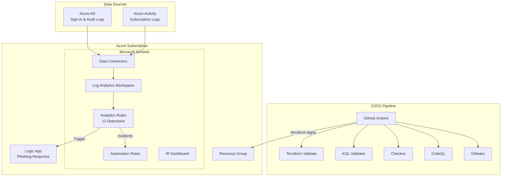

# Sentinel Detection Lab

Detection-as-code framework for Microsoft Sentinel, deploying analytics rules, incident response playbooks, and dashboards via Terraform with full CI/CD integration.

## Architecture



## MITRE ATT&CK Coverage

| Tactic | Technique | Detection | Severity |
|--------|-----------|-----------|----------|
| Credential Access | T1110.001 - Brute Force | Brute Force Sign-in Attempts | Medium |
| Credential Access | T1110.003 - Password Spraying | Password Spray Attack | High |
| Credential Access | T1078 - Valid Accounts | Impossible Travel Sign-in | High |
| Initial Access | T1566.001 - Phishing | Suspicious Inbox Rule Created | High |
| Initial Access | T1566.002 - Spearphishing Link | Suspicious OAuth Application Consent | Medium |
| Persistence | T1137.005 - Office Application Startup | New Inbox Forwarding Rule | Medium |
| Persistence | T1136.003 - Create Cloud Account | Suspicious Service Principal Creation | Medium |
| Lateral Movement | T1021.001 - Remote Desktop Protocol | Anomalous RDP Sign-in | Medium |
| Lateral Movement | T1078.002 - Domain Accounts | Multi-Host Admin Logon | High |
| Exfiltration | T1567 - Exfiltration Over Web Service | Bulk File Download | Medium |
| Exfiltration | T1114.003 - Email Forwarding Rule | Mail Forwarding to External Domain | High |
| Defense Evasion | T1027 - Obfuscated Files | Encoded PowerShell Execution | High |

## Prerequisites

- Azure subscription (free trial works)
- [Terraform](https://www.terraform.io/downloads) >= 1.5.0
- [Azure CLI](https://docs.microsoft.com/en-us/cli/azure/install-azure-cli) (`az login` authenticated)
- Python 3.11+ (for KQL validation)

## Quick Start

```bash
# Clone
git clone https://github.com/n1ops/sentinel-detection-lab.git
cd sentinel-detection-lab

# Authenticate to Azure
az login

# Deploy infrastructure
cd terraform
terraform init
terraform plan -out=tfplan
terraform apply tfplan

# Validate detections locally
python scripts/validate_kql.py
```

## Project Structure

```
sentinel-detection-lab/
├── terraform/                    # Infrastructure as Code
│   ├── main.tf                   # Provider, backend, resource group
│   ├── variables.tf              # Input variables
│   ├── outputs.tf                # Workspace IDs, Sentinel URL
│   ├── sentinel.tf               # Log Analytics + Sentinel onboarding
│   ├── data-connectors.tf        # Azure AD + Azure Activity connectors
│   ├── analytics-rules.tf        # 12 KQL detection rules as code
│   └── automation-rules.tf       # Auto-severity, auto-triage rules
├── detections/                   # KQL detection library
│   ├── credential-access/        # Brute force, password spray, impossible travel
│   ├── initial-access/           # Phishing inbox rules, OAuth consent
│   ├── persistence/              # Forwarding rules, service principals
│   ├── lateral-movement/         # Anomalous RDP, multi-host admin
│   ├── exfiltration/             # Bulk downloads, mail forwarding
│   └── defense-evasion/          # Encoded PowerShell
├── playbooks/                    # Incident response automation
│   └── phishing-response/        # Logic App ARM template
├── workbooks/                    # Sentinel dashboards
│   └── ir-dashboard.json         # 6-tile IR dashboard
├── scripts/
│   └── validate_kql.py           # KQL metadata validator
└── .github/workflows/
    ├── security.yml              # Reusable DevSecOps pipeline
    └── sentinel-validate.yml     # PR validation for KQL + Terraform
```

## Detection Library

Each detection is a standalone `.kql` file with a standardized metadata header:

```
// Name: Detection Name
// MITRE: T1110.001 - Credential Access / Brute Force
// Severity: Medium
// Description: What this detection finds
// Query Frequency: 1h
// Query Period: 1h
// Trigger: gt 0
```

Detections query standard Sentinel tables: `SigninLogs`, `AuditLogs`, `OfficeActivity`, and `SecurityEvent`.

## CI/CD Pipeline

### Security Pipeline (`security.yml`)

Calls the [n1ops/devsecops-pipeline-reference](https://github.com/n1ops/devsecops-pipeline-reference) reusable workflow:

- **Gitleaks** — Secret detection across all commits
- **CodeQL** — Static analysis of Python validation scripts
- **Checkov** — IaC security scanning of Terraform configs
- **KQL Validator** — Metadata and format validation of all detections

### PR Validation (`sentinel-validate.yml`)

Runs on pull requests touching detections, playbooks, or Terraform:

- Validates KQL metadata headers (Name, MITRE, Severity, Description)
- Validates ARM template JSON structure
- Runs `terraform validate` and `terraform fmt -check`

## IR Playbook

The phishing response playbook (`playbooks/phishing-response/azuredeploy.json`) is a Logic App that:

1. Triggers on Sentinel incident creation
2. Extracts entities (IP, Account, URL)
3. Posts enrichment details to a Teams channel
4. Adds a comment to the Sentinel incident
5. Tags the incident with MITRE technique identifiers

## IR Dashboard

The workbook (`workbooks/ir-dashboard.json`) provides 6 visualization tiles:

1. **Incidents over time** — Bar chart by severity
2. **Top targeted accounts** — Table of most-attacked users
3. **MITRE ATT&CK coverage** — Grid of active detections by tactic
4. **Open incidents by age** — Heatmap showing incident aging
5. **Alert source distribution** — Pie chart by product
6. **MTTR trend** — Mean time to resolve over time

## Terraform Resources

| Resource | Type | Purpose |
|----------|------|---------|
| Resource Group | `azurerm_resource_group` | Container for all resources |
| Log Analytics Workspace | `azurerm_log_analytics_workspace` | PerGB2018 SKU, 31-day retention |
| Sentinel Onboarding | `azurerm_sentinel_log_analytics_workspace_onboarding` | Enables Sentinel on workspace |
| Azure AD Connector | `azurerm_sentinel_data_connector_azure_active_directory` | Sign-in and audit logs |
| Activity Log Connector | `azurerm_monitor_diagnostic_setting` | Azure subscription activity |
| Analytics Rules (x12) | `azurerm_sentinel_alert_rule_scheduled` | KQL detection rules |
| Automation Rules (x3) | `azurerm_sentinel_automation_rule` | Auto-triage and auto-close |

## License

MIT
