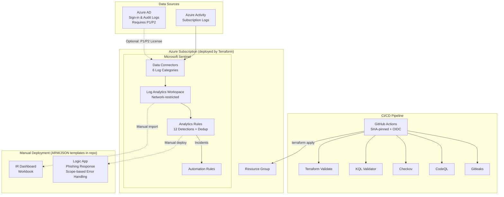

# Sentinel Detection Lab

Detection-as-code framework for Microsoft Sentinel. Terraform deploys the Sentinel workspace, 12 analytics rules, and 3 automation rules using a modular architecture. The repo also includes an IR playbook (ARM template) and dashboard (Workbook JSON) that require separate manual deployment steps documented below.

## Overview

This project implements a complete Security Operations Center (SOC) detection pipeline for Microsoft Sentinel using infrastructure-as-code principles. Every detection rule, automation workflow, and infrastructure component is version-controlled, validated in CI/CD, and deployed through Terraform — eliminating manual portal configuration and enabling detection engineering workflows through pull requests.

### What this project does

The core deployment (`terraform apply`) stands up a fully functional Sentinel environment from scratch:

1. **A Log Analytics Workspace with Sentinel enabled** — The foundation. Public network access is disabled (`internet_ingestion_enabled = false`, `internet_query_enabled = false`) — ingestion and queries must flow through Private Link or trusted Azure services. Azure Activity Logs (Administrative, Security, Alert, Policy, ServiceHealth, and ResourceHealth categories) are ingested automatically via a diagnostic setting on the subscription. Azure AD sign-in and audit logs require a P1/P2 license and are not enabled by default. Critical resources (workspace and Sentinel onboarding) are protected with `lifecycle { prevent_destroy = true }`.

2. **12 scheduled analytics rules covering 6 MITRE ATT&CK tactics** — Each rule is a standalone KQL query file in `detections/` that Terraform reads and deploys as a `azurerm_sentinel_alert_rule_scheduled` resource. The queries run on a 1-hour frequency against standard Sentinel tables (`SigninLogs`, `AuditLogs`, `OfficeActivity`, `SecurityEvent`) and generate alerts when thresholds are exceeded. Entity mappings (Account, IP, Host) are configured per rule so Sentinel can correlate alerts into incidents and display entity pages. Each rule includes `custom_details` for alert deduplication and uses `AlertPerResult` event grouping to prevent duplicate incidents.

3. **3 automation rules for incident triage** — High-severity incidents are automatically set to Active status. Incidents matching phishing techniques (T1566) are auto-tagged with `Phishing` and `InitialAccess` labels. Informational-severity incidents are auto-closed with an `Undetermined` classification to avoid premature benign-positive labeling. These run on every incident creation and reduce analyst toil for common triage decisions.

4. **Incident grouping with deduplication** — Each analytics rule is configured with alert grouping using the `AllEntities` matching method with a 5-hour lookback window plus `by_custom_details` grouping. When the same account or IP triggers the same rule multiple times, Sentinel groups those alerts into a single incident rather than flooding the queue with duplicates.

### What this project includes but does not auto-deploy

The repository also contains two templates that require manual deployment:

- **An IR playbook for phishing response** (`playbooks/phishing-response/azuredeploy.json`) — An ARM template defining a Logic App that triggers on Sentinel incident creation (severity > Informational), extracts IP/Account/URL entities via a `Main_Processing_Scope`, posts a formatted enrichment report to a Microsoft Teams channel (with HTML-encoded incident data to prevent injection), adds a comment to the incident, and tags it with MITRE technique identifiers. If any action fails, an `Error_Handling_Scope` catches the failure and posts an error notification to Teams plus an error comment on the incident. This requires deploying the ARM template, authorizing the Teams and Sentinel API connections in the Azure Portal, and assigning the Sentinel Responder RBAC role to the Logic App's managed identity. Full steps are documented in the [IR Playbook](#ir-playbook-manual-deployment-required) section.

- **An IR dashboard** (`workbooks/ir-dashboard.json`) — A Sentinel Workbook template with 6 KQL-powered visualization tiles (incident trends, targeted accounts, MITRE coverage, incident aging, alert sources, and mean time to resolve). This requires manual import through the Sentinel Portal's Workbook Advanced Editor. Full steps are documented in the [IR Dashboard](#ir-dashboard-manual-import-required) section.

### How CI/CD works

Every push to `main` and every pull request triggers two GitHub Actions workflows. All actions are pinned to full SHA hashes to prevent supply-chain attacks, workflows use least-privilege `permissions:` blocks, and OIDC is used for Azure authentication (no static secrets).

- **`security.yml`** calls the [n1ops/devsecops-pipeline-reference](https://github.com/n1ops/devsecops-pipeline-reference) reusable pipeline (pinned to commit SHA), which runs Gitleaks (secret detection), CodeQL (static analysis), Checkov (Terraform IaC scanning), and the KQL validator as the test stage. Only the required OIDC secrets (`AZURE_CLIENT_ID`, `AZURE_TENANT_ID`, `AZURE_SUBSCRIPTION_ID`) are forwarded — no blanket `secrets: inherit`.

- **`sentinel-validate.yml`** runs specifically on PRs that touch detection files, playbooks, or Terraform. It validates that all `.kql` files have required metadata headers (Name, MITRE, Severity, Description), validates ARM template JSON structure (using safe `find -print0` piping to prevent shell injection), and runs `terraform validate` + `terraform fmt -check`. Both workflows have concurrency controls and `timeout-minutes` to prevent runaway jobs.

The KQL validator (`scripts/validate_kql.py`) enforces a consistent metadata format across all detections: every `.kql` file must declare its name, MITRE technique ID (matching `T\d{4}` format), severity (one of Informational/Low/Medium/High), and a human-readable description. The validator includes symlink protection, a 1MB file size limit, and UTF-8 encoding error handling.

### Why detection-as-code

Traditional SOC workflows involve analysts creating detection rules manually in the Sentinel portal. This approach has problems: no version history, no peer review, no automated testing, and no way to reproduce the environment if the workspace is lost. By storing every rule as a `.kql` file and deploying through Terraform:

- **New detections go through pull requests** — reviewed by the team, validated by CI, merged when approved
- **Changes are tracked in git history** — who changed what, when, and why
- **The entire environment is reproducible** — `terraform destroy` and `terraform apply` rebuilds everything from scratch
- **Detection quality is enforced** — the validator rejects rules without MITRE mappings or proper metadata

## Architecture



## Security

This project has undergone a comprehensive security audit with 68 findings across Terraform, GitHub Actions, KQL detections, ARM templates, and git configuration. All actionable findings have been remediated. See [SECURITY_AUDIT_REPORT.md](./SECURITY_AUDIT_REPORT.md) for the full audit and [REMEDIATION_CHANGELOG.md](./REMEDIATION_CHANGELOG.md) for the detailed changelog.

Key security measures:

- **Supply chain protection** — All GitHub Actions pinned to full commit SHA hashes; Dependabot configured for weekly action updates; CODEOWNERS requires review from `@n1ops`
- **Zero static secrets** — OIDC federated credentials for Azure auth; no hardcoded keys, passwords, or connection strings anywhere in the codebase
- **Secret detection** — Gitleaks with custom Azure-specific rules (storage connection strings, service principal secrets, SAS tokens); `.tfstate` is NOT allowlisted
- **Input validation** — Terraform variable validation blocks, ARM template `minLength` constraints, Python script safety checks (symlink protection, file size limits, encoding handling)
- **Least privilege** — Workflow `permissions: contents: read` + `id-token: write`; explicit secret forwarding instead of `secrets: inherit`
- **HTML injection prevention** — All user-controllable incident data in the playbook is encoded with `replace()` before rendering in Teams messages
- **Infrastructure hardening** — Network-restricted workspace, `lifecycle { prevent_destroy }`, suppression duration on alerts, `Undetermined` classification for auto-closed incidents

## Deployment Results

This project was deployed and validated against a live Azure subscription. `terraform apply` provisions 19 resources automatically. The playbook and workbook are **not** deployed by Terraform — they are ARM/JSON templates that require separate manual steps.

| Resource | Count | Deployed by | Status |
|----------|-------|-------------|--------|
| Resource Group (`rg-sentinel-lab`) | 1 | `terraform apply` | Deployed |
| Log Analytics Workspace (PerGB2018, 31-day retention, network-restricted) | 1 | `terraform apply` | Deployed |
| Sentinel Onboarding | 1 | `terraform apply` | Deployed |
| Azure Activity Log Connector (6 categories) | 1 | `terraform apply` | Deployed |
| Scheduled Analytics Rules (with dedup keys) | 12 | `terraform apply` | Deployed |
| Automation Rules | 3 | `terraform apply` | Deployed |
| Azure AD Connector | 1 | `terraform apply` | Requires P1/P2 license |
| IR Playbook (Logic App) | 1 | Manual ARM deployment | Not deployed |
| IR Dashboard (Workbook) | 1 | Manual Sentinel import | Not deployed |

### Azure AD Connector (Not Deployed)

The Azure AD sign-in and audit log connector (`azurerm_sentinel_data_connector_azure_active_directory`) requires an **Azure AD P1 or P2 license** and returns `InvalidLicense` (HTTP 401) without one. This connector is commented out in `terraform/modules/connectors/main.tf` and can be enabled by uncommenting the resource block once the appropriate licensing is in place.

The Azure Activity Log connector works without any additional licensing and is deployed by default, providing Administrative, Security, Alert, Policy, ServiceHealth, and ResourceHealth log categories.

### Deployment Notes

During deployment, several Sentinel API constraints were discovered and addressed:

- **MITRE technique format**: The Sentinel API only accepts parent technique IDs in `T####` format (e.g., `T1110`), not sub-techniques like `T1110.003`. Sub-technique detail is preserved in the KQL file metadata headers for documentation purposes.
- **Tactic/technique alignment**: Each technique must be paired with a tactic that MITRE maps it to. For example, `T1078` (Valid Accounts) maps to `InitialAccess`/`Persistence`/`PrivilegeEscalation`/`DefenseEvasion` but not `CredentialAccess` or `LateralMovement`.
- **Entity mapping columns**: Entity mappings must reference columns that exist in the KQL query output. Each detection exports standardized `Entity_Account`, `Entity_IP`, and/or `Entity_Host` columns for this purpose.
- **Automation rule names**: Must be valid UUIDs, not human-readable strings.
- **Automation rule conditions**: The `condition_json` field expects a JSON array (`[{...}]`), not an object with a `clauses` key.
- **Incident classification**: Must use full enum values like `Undetermined`, not shortened forms.
- **Resource provider registration**: On fresh subscriptions with `azurerm` ~>4.0, auto-registration can hit 409 conflicts. Setting `resource_provider_registrations = "none"` in the provider block and manually registering only the needed providers (`Microsoft.OperationalInsights`, `Microsoft.SecurityInsights`, `Microsoft.OperationsManagement`, `Microsoft.Insights`) resolves this.

## MITRE ATT&CK Coverage

| Tactic | Technique | Detection | Severity |
|--------|-----------|-----------|----------|
| Credential Access | T1110 - Brute Force | Brute Force Sign-in Attempts (threshold: 25, success correlation) | Medium |
| Credential Access | T1110 - Password Spraying | Password Spray Attack (two-stage: failed + success join) | High |
| Initial Access | T1078 - Valid Accounts | Impossible Travel Sign-in (Haversine distance, 900+ km/h) | High |
| Initial Access | T1566 - Phishing | Suspicious Inbox Rule Created (hardcoded + non-standard folder detection) | High |
| Initial Access | T1566 - Spearphishing Link | Suspicious OAuth Application Consent (dynamic property lookup) | Medium |
| Persistence | T1137 - Office Application Startup | New Inbox Forwarding Rule (Watchlist-ready domain filtering) | Medium |
| Persistence | T1136 - Create Cloud Account | Suspicious Service Principal Creation (with allow-list) | Medium |
| Lateral Movement | T1021 - Remote Desktop Protocol | Anomalous RDP Sign-in (14-day baseline, off-hours/weekend flags) | Medium |
| Lateral Movement | T1078 - Valid Accounts | Multi-Host Admin Logon (case-insensitive, Entity_IP) | High |
| Exfiltration | T1567 - Exfiltration Over Web Service | Bulk File Download (RecordType type-safe) | Medium |
| Collection / Exfiltration | T1114 - Email Forwarding Rule | Mail Forwarding to External Domain (Watchlist-ready) | High |
| Defense Evasion | T1027 - Obfuscated Files | Encoded PowerShell (caret evasion, parent process, hidden window) | High |

All SigninLogs-based detections include `ConditionalAccessStatus`, `RiskLevelDuringSignIn`, and `RiskState` enrichment fields.

## Prerequisites

- Azure subscription (free trial works)
- [Terraform](https://www.terraform.io/downloads) >= 1.9.0
- [Azure CLI](https://docs.microsoft.com/en-us/cli/azure/install-azure-cli) (`az login` authenticated)
- Python 3.11+ (for KQL validation)
- **Owner** or **Contributor** role on the Azure subscription
- Azure AD P1/P2 license (optional, for Azure AD sign-in/audit log connector)
- For OIDC CI/CD: Entra ID federated credential configured for GitHub Actions + three GitHub secrets (`AZURE_CLIENT_ID`, `AZURE_TENANT_ID`, `AZURE_SUBSCRIPTION_ID`)

## Quick Start

```bash
# Clone
git clone https://github.com/n1ops/sentinel-detection-lab.git
cd sentinel-detection-lab

# Authenticate to Azure
az login --tenant <your-tenant>.onmicrosoft.com

# Register required resource providers (first-time only)
az provider register --namespace Microsoft.OperationalInsights --wait
az provider register --namespace Microsoft.SecurityInsights --wait
az provider register --namespace Microsoft.OperationsManagement --wait
az provider register --namespace Microsoft.Insights --wait

# Deploy infrastructure
cd terraform
terraform init
terraform plan -out=tfplan
terraform apply tfplan

# Validate detections locally
cd ..
python scripts/validate_kql.py
```

### Enabling the Azure AD Connector

If you have Azure AD P1/P2 licensing, uncomment the Azure AD connector in `terraform/modules/connectors/main.tf`:

```hcl
resource "azurerm_sentinel_data_connector_azure_active_directory" "aad" {
  name                       = "aad-connector"
  log_analytics_workspace_id = var.workspace_id
  tenant_id                  = data.azurerm_subscription.current.tenant_id
}
```

Then run `terraform apply` to deploy the connector. This enables ingestion of Azure AD sign-in logs and audit logs into the Sentinel workspace.

### Teardown

```bash
cd terraform
terraform destroy
```

> **Note**: The workspace and Sentinel onboarding resources have `lifecycle { prevent_destroy = true }`. To tear down the full environment, you must first remove or comment out the lifecycle blocks in `terraform/modules/workspace/main.tf`, then run `terraform destroy`.

## Project Structure

```
sentinel-detection-lab/
├── terraform/                           # Infrastructure as Code (modular)
│   ├── main.tf                          # Provider, backend, module calls
│   ├── variables.tf                     # Root input variables
│   ├── outputs.tf                       # Root outputs (references modules)
│   └── modules/
│       ├── workspace/                   # Log Analytics + Sentinel onboarding
│       │   ├── main.tf                  # RG, workspace (network-restricted), onboarding
│       │   ├── variables.tf             # location, resource_prefix, log_retention_days
│       │   └── outputs.tf              # workspace_id, subscription_id, portal URL
│       ├── analytics-rules/             # 12 KQL detection rules
│       │   ├── main.tf                  # Rules with custom_details + AlertPerResult dedup
│       │   └── variables.tf             # workspace_id, detections_path
│       ├── automation/                  # 3 automation rules
│       │   ├── main.tf                  # Auto-assign, auto-tag, auto-close
│       │   └── variables.tf             # workspace_id
│       └── connectors/                  # Data connectors + diagnostic settings
│           ├── main.tf                  # Activity logs (6 categories), AAD (optional)
│           └── variables.tf             # workspace_id, subscription_id
├── detections/                          # KQL detection library
│   ├── credential-access/               # Brute force, password spray, impossible travel
│   ├── initial-access/                  # Phishing inbox rules, OAuth consent
│   ├── persistence/                     # Forwarding rules, service principals
│   ├── lateral-movement/                # Anomalous RDP, multi-host admin
│   ├── exfiltration/                    # Bulk downloads, mail forwarding
│   └── defense-evasion/                 # Encoded PowerShell (evasion-resistant)
├── playbooks/                           # Incident response automation (manual deploy)
│   └── phishing-response/               # Logic App ARM template with Scope error handling
├── workbooks/                           # Sentinel dashboards (manual import)
│   └── ir-dashboard.json                # 6-tile IR dashboard
├── scripts/
│   └── validate_kql.py                  # KQL metadata validator (hardened)
├── .github/
│   ├── workflows/
│   │   ├── security.yml                 # DevSecOps pipeline (SHA-pinned, OIDC)
│   │   └── sentinel-validate.yml        # PR validation (SHA-pinned, OIDC)
│   ├── dependabot.yml                   # Weekly GitHub Actions updates
│   └── CODEOWNERS                       # @n1ops review required
├── .gitleaks.toml                       # Custom Azure secret detection rules
├── SECURITY_AUDIT_REPORT.md             # Comprehensive 68-finding audit
└── REMEDIATION_CHANGELOG.md             # Detailed remediation changelog
```

## Detection Library

Each detection is a standalone `.kql` file with a standardized metadata header:

```
// Name: Detection Name
// MITRE: T1110.001 - Credential Access / Brute Force
// Severity: Medium
// Description: What this detection finds
// Query Frequency: 1h
// Query Period: 1h
// Trigger: gt 0
```

Detections query standard Sentinel tables: `SigninLogs`, `AuditLogs`, `OfficeActivity`, and `SecurityEvent`. Each query exports standardized entity columns (`Entity_Account`, `Entity_IP`, `Entity_Host`) for Sentinel entity mapping. All SigninLogs-based rules include `ConditionalAccessStatus`, `RiskLevelDuringSignIn`, and `RiskState` for enrichment.

## CI/CD Pipeline

### Security Pipeline (`security.yml`)

Calls the [n1ops/devsecops-pipeline-reference](https://github.com/n1ops/devsecops-pipeline-reference) reusable workflow (pinned to commit SHA):

- **Gitleaks** — Secret detection with custom Azure-specific rules
- **CodeQL** — Static analysis of Python validation scripts
- **Checkov** — IaC security scanning of Terraform configs
- **KQL Validator** — Metadata and format validation of all detections

### PR Validation (`sentinel-validate.yml`)

Runs on pull requests touching detections, playbooks, or Terraform:

- Validates KQL metadata headers (Name, MITRE, Severity, Description)
- Validates ARM template JSON structure (shell-injection-safe `find -print0` piping)
- Runs `terraform validate` and `terraform fmt -check`

Both workflows use SHA-pinned actions, OIDC authentication, least-privilege permissions, concurrency controls, and job timeouts.

## IR Playbook (Manual Deployment Required)

> **Not deployed by `terraform apply`.** This is an ARM template that must be deployed separately.

The file `playbooks/phishing-response/azuredeploy.json` is an ARM template that defines a Logic App with structured error handling. When deployed and fully configured, it:

1. Triggers on Sentinel incident creation (severity > Informational)
2. Initializes entity collection variables
3. Enters the **Main Processing Scope** which:
   - Extracts entities (IP, Account, URL) via the Sentinel API connector
   - Posts HTML-encoded enrichment details to a Microsoft Teams channel
   - Adds a comment to the Sentinel incident
   - Tags the incident with MITRE technique identifiers (T1566-Phishing)
4. If any action in the Main Scope fails, the **Error Handling Scope** catches it and:
   - Posts an error notification to the Teams channel
   - Adds an error comment to the Sentinel incident

### How to deploy the playbook

```bash
# Deploy the ARM template into the same resource group
az deployment group create \
  --resource-group rg-sentinel-lab \
  --template-file playbooks/phishing-response/azuredeploy.json \
  --parameters \
    SentinelWorkspaceId="<your-workspace-resource-id>" \
    TeamsChannelId="<your-teams-channel-id>" \
    TeamsGroupId="<your-teams-group-id>"
```

### Post-deployment manual steps

1. **Authorize the Teams API connection**: In the Azure Portal, go to the Logic App > API Connections > `teams` connection > Edit API connection > Authorize. This requires a user with access to the target Teams channel to sign in and grant consent.
2. **Authorize the Sentinel API connection**: Same process for the `azuresentinel` connection, or it will use the Logic App's managed identity if the role is assigned.
3. **Assign RBAC role**: The Logic App uses a SystemAssigned managed identity. Grant it the **Microsoft Sentinel Responder** role on the Sentinel workspace so it can read incidents, add comments, and update tags:
   ```bash
   az role assignment create \
     --assignee "<logic-app-managed-identity-principal-id>" \
     --role "Microsoft Sentinel Responder" \
     --scope "<sentinel-workspace-resource-id>"
   ```
4. **Test the playbook**: Create a test incident in Sentinel and verify the Logic App triggers, posts to Teams, and adds a comment.

Without these manual steps, the Logic App will deploy but will **not** be able to connect to Teams or interact with Sentinel incidents.

## IR Dashboard (Manual Import Required)

> **Not deployed by `terraform apply`.** This is a Workbook JSON template that must be imported manually into Sentinel.

The file `workbooks/ir-dashboard.json` is a Sentinel Workbook template with 6 visualization tiles:

1. **Incidents over time** — Bar chart by severity
2. **Top targeted accounts** — Table of most-attacked users
3. **MITRE ATT&CK coverage** — Grid of active detections by tactic
4. **Open incidents by age** — Heatmap showing incident aging
5. **Alert source distribution** — Pie chart by product
6. **MTTR trend** — Mean time to resolve over time

### How to import the workbook

1. Open the Azure Portal and navigate to **Microsoft Sentinel** > your workspace > **Workbooks**
2. Click **Add workbook** > **Advanced Editor** (the `</>` icon)
3. Replace the contents with the JSON from `workbooks/ir-dashboard.json`
4. Update the `fallbackResourceIds` array at the bottom of the JSON to reference your actual workspace resource ID
5. Click **Apply** then **Save**

The workbook queries `SecurityIncident` and `SecurityAlert` tables, so it will only show data once incidents start being generated by the analytics rules.

## What `terraform apply` Deploys

| Resource | Type | Status |
|----------|------|--------|
| Resource Group | `azurerm_resource_group` | Deployed |
| Log Analytics Workspace (network-restricted) | `azurerm_log_analytics_workspace` | Deployed |
| Sentinel Onboarding | `azurerm_sentinel_log_analytics_workspace_onboarding` | Deployed |
| Azure AD Connector | `azurerm_sentinel_data_connector_azure_active_directory` | Commented out (requires P1/P2) |
| Activity Log Connector (6 categories) | `azurerm_monitor_diagnostic_setting` | Deployed |
| Analytics Rules (x12, with dedup) | `azurerm_sentinel_alert_rule_scheduled` | Deployed |
| Automation Rules (x3) | `azurerm_sentinel_automation_rule` | Deployed |

## What Requires Manual Deployment

| Resource | Template File | Deploy Method |
|----------|--------------|---------------|
| IR Playbook (Logic App) | `playbooks/phishing-response/azuredeploy.json` | `az deployment group create` + manual API connection auth |
| IR Dashboard (Workbook) | `workbooks/ir-dashboard.json` | Manual import via Sentinel Portal > Workbooks > Advanced Editor |

## Why Terraform

This project uses Terraform to manage Sentinel infrastructure rather than the Azure Portal, ARM templates, or Azure CLI scripts. Here's why:

**Declarative state management** — Terraform tracks every resource it creates in a state file. Run `terraform plan` at any time to see exactly what exists, what's changed, and what would happen on the next apply. If someone modifies a rule in the portal, the next plan shows the drift. This is something ARM templates and CLI scripts can't do — they execute but don't track what they've created.

**Idempotent deployments** — Running `terraform apply` twice produces the same result. If 10 of 12 rules deployed successfully and 2 failed (as happened during this project's deployment), re-running apply only creates the 2 missing rules. ARM templates and CLI scripts would either fail on duplicates or require you to track what succeeded yourself.

**Dependency resolution** — Terraform understands that analytics rules depend on the Sentinel workspace, which depends on the Log Analytics workspace, which depends on the resource group. It builds and destroys resources in the correct order automatically. The `for_each` loop in the analytics-rules module deploys all 12 detection rules in parallel while respecting the dependency on the workspace — no manual orchestration needed.

**Modular architecture** — The Terraform configuration is split into four modules (`workspace`, `analytics-rules`, `automation`, `connectors`), each independently testable and reusable. Adding a new detection means adding a `.kql` file and a new entry in the analytics-rules module's `detection_files` local. The modules can be composed differently for different environments (e.g., production vs. lab).

**Change management through code review** — Every change to the detection pipeline goes through a pull request. Reviewers see exactly what's changing, CI validates the KQL metadata and Terraform syntax, and the merge history provides a complete audit trail of who changed what and when.

**Reproducible environments** — `terraform destroy` tears down every resource. `terraform apply` rebuilds the entire environment from scratch. This makes it possible to spin up identical Sentinel labs for testing, training, or incident simulation without manual portal clicks.

**Drift detection** — If an analyst modifies a rule's severity or query in the Sentinel portal, the next `terraform plan` will show the difference and `terraform apply` will revert it to the version in code. This ensures the git repository remains the single source of truth for all detection rules, not the portal.

## License

MIT
